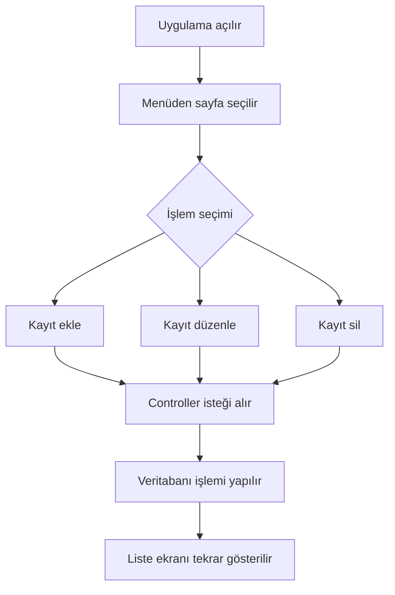
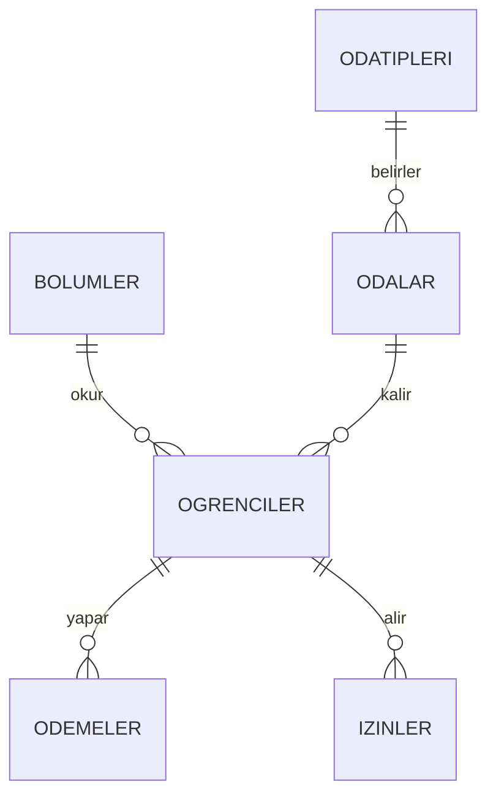

# Yurt Otomasyon Sistemi

## Problem Tanımı

Yurtlarda öğrencilerin oda, bölüm, ödeme ve izin bilgilerinin düzenli şekilde takip edilmesi gerekir. Bu bilgiler dağınık tutulduğunda oda doluluk durumu, öğrenci ödemeleri ve izin kayıtları karışabilir.

Bu projede amaç; öğrencilerin hangi bölümde okuduğunu, hangi odada kaldığını, odaların kapasite ve ücret bilgilerini, öğrencilerin ödeme kayıtlarını ve izin bilgilerini bir web uygulaması üzerinden takip etmektir.

## Yapılan Araştırmalar

Proje geliştirilirken ASP.NET Core MVC yapısı, SQL Server tablo ilişkileri ve temel veritabanı nesneleri incelenmiştir [1][2].

Bizde yurtta kaldığımız için yurttaki arkadaşlarımızla tartışıp araştırmalar yaptık.

## Kullanılan Teknolojiler

- ASP.NET Core MVC
- C#
- SQL Server
- ADO.NET
- Bootstrap

## Yazılım Mimarisi

Proje ASP.NET Core MVC mimarisi ile hazırlanmıştır [1].

- `Models`: Veritabanındaki tabloları temsil eden C# sınıflarıdır.
- `Controllers`: Sayfalardan gelen istekleri işler ve veritabanı işlemlerini yapar.
- `Views`: Kullanıcının gördüğü listeleme ve form ekranlarıdır.
- `Data/Db.cs`: SQL Server bağlantısı ve sorgu çalıştırma işlemlerinin ortak kullanıldığı sınıftır.
- `Database/14_sql_betikleri.sql`: Tablolar, ilişkiler, view, trigger, stored procedure, index ve örnek verilerin bulunduğu SQL dosyasıdır.

## Genel Yapı

Uygulamada öğrenciler, bölümler, oda tipleri, odalar, ödemeler ve izinler ayrı sayfalarda yönetilir.

Her temel sayfada basit şekilde listeleme, ekleme, düzenleme ve silme işlemleri bulunur. Proje özellikle Veritabanı Yönetim Sistemleri dersi için sade tutulmuştur. Login, rol sistemi veya karmaşık yönetim paneli eklenmemiştir.

## Veritabanı Tabloları

- `Bolumler`
- `OdaTipleri`
- `Odalar`
- `Ogrenciler`
- `Odemeler`
- `Izinler`

## İlişkiler

- `Ogrenciler.BolumID` → `Bolumler.BolumID`
- `Ogrenciler.OdaID` → `Odalar.OdaID`
- `Odalar.OdaTipID` → `OdaTipleri.OdaTipID`
- `Odemeler.OgrenciID` → `Ogrenciler.OgrenciID`
- `Izinler.OgrenciID` → `Ogrenciler.OgrenciID`

## Kullanılan Veritabanı Yapıları

- Primary Key
- Foreign Key
- Unique
- Check
- Default
- Index
- View
- Trigger
- Stored Procedure

## Viewler

- `vw_OgrenciDetayListesi`: Öğrenci, bölüm, oda ve oda tipi bilgilerini birlikte gösterir.
- `vw_OdaDolulukOzeti`: Odaların kapasite, öğrenci sayısı ve boş yatak bilgilerini gösterir.

## Triggerlar

- `trg_OgrenciEkle_OdaSayisi`: Öğrenci eklenince oda öğrenci sayısını artırır ve kapasite kontrolü yapar.
- `trg_OgrenciSil_OdaSayisi`: Öğrenci silinince oda öğrenci sayısını azaltır.

## Stored Procedureler

- `sp_OgrenciEkle`: Öğrenci ekler, TC tekrarını ve oda kapasitesini kontrol eder.
- `sp_OdemeEkle`: Ödeme ekler ve ödeme tutarının sıfırdan büyük olmasını kontrol eder.

## Indexler

- `IX_Ogrenciler_TC`: TC numarasına göre öğrenci aramayı hızlandırmak için kullanılır.
- `IX_Odemeler_OdemeTarihi`: Ödeme tarihine göre sorguları hızlandırmak için kullanılır.

## Akış Şeması

## Veri Tabanı Diyagramı

## Ekranlar

- Ana Sayfa
- Bölümler
- Oda Tipleri
- Odalar
- Öğrenciler
- Ödemeler
- İzinler

## Referanslar

[1] Microsoft Learn, ASP.NET Core MVC dokümantasyonu: https://learn.microsoft.com/aspnet/core/mvc/overview

[2] Microsoft Learn, SQL Server dokümantasyonu: https://learn.microsoft.com/sql/sql-server/

[3] Bootstrap dokümantasyonu: https://getbootstrap.com/docs/

[4] Google Gemini: https://gemini.google.com/
